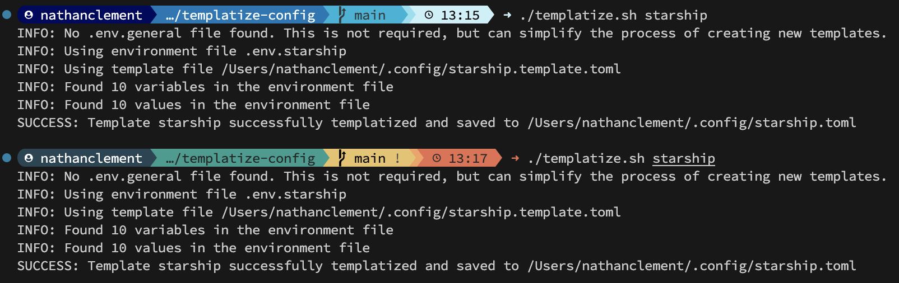

# Templatize Config

This tool helps you generate config files with variables.

This makes it easier to keep your favorite settings available across different accounts, environments, or hardware. It also makes it easier to make changes to complicated configuration files (like changing colors across a customized `starship.toml`)

For example, with the examples below, you can change your starship color configurations very easily, which used to be a complex and complicated process.



All you have to do is create a template configuration file, filled with variables that might change depending on your preferences.

Then set up an environment file for that configuration, and run the `./templatize` command.

## How to use

1. Clone or fork this repository
2. Create a Template Configuration File (for example `~/.config/starship.toml`)
3. Create a `.env` file based on the example below - you can name it something like `.env.starship`
4. From the root directory of this repository, run `./templatize.sh starship`
5. The script will output a new file based on your configuration!

## Configuration Examples

### `env.general`

```text
TEMPLATE_VAR_MY_USERNAME="my_user"
```

### `env.starship`

```text
SRC_CONFIG_PATH="~/.config/starship.template.toml"
DST_CONFIG_PATH="~/.config/starship.toml"

# Green to Red
TEMPLATE_VAR_COLOR_1="#264653"
TEMPLATE_VAR_TEXT_COLOR_1="#ffffff"
TEMPLATE_VAR_COLOR_2="#2a9d8f"
TEMPLATE_VAR_TEXT_COLOR_2="#ffffff"
TEMPLATE_VAR_COLOR_3="#e9c46a"
TEMPLATE_VAR_TEXT_COLOR_3="#000000"
TEMPLATE_VAR_COLOR_4="#f4a261"
TEMPLATE_VAR_TEXT_COLOR_4="#000000"
TEMPLATE_VAR_COLOR_5="#e76f51"
TEMPLATE_VAR_TEXT_COLOR_5="#ffffff"

# Blues
# TEMPLATE_VAR_COLOR_1="#03045e"
# TEMPLATE_VAR_TEXT_COLOR_1="#ffffff"
# TEMPLATE_VAR_COLOR_2="#0077b6"
# TEMPLATE_VAR_TEXT_COLOR_2="#ffffff"
# TEMPLATE_VAR_COLOR_3="#00b4d8"
# TEMPLATE_VAR_TEXT_COLOR_3="#ffffff"
# TEMPLATE_VAR_COLOR_4="#90e0ef"
# TEMPLATE_VAR_TEXT_COLOR_4="#000000"
# TEMPLATE_VAR_COLOR_5="#caf0f8"
# TEMPLATE_VAR_TEXT_COLOR_5="#000000"
```

### `starship.template.toml`

_Note that for starship to work, you must have a nerdfont installed, and set as the font for your terminal, and that the default Mac Terminal will not render colors properly. Try using iTerm2 and installing nerdfonts per this gist <https://gist.github.com/davidteren/898f2dcccd42d9f8680ec69a3a5d350e.js>_

```toml
# Get editor completions based on the config schema
"$schema" = 'https://starship.rs/config-schema.json'

format = """
[]({{TEMPLATE_VAR_COLOR_1}})\
$os\
$username\
[](bg:{{TEMPLATE_VAR_COLOR_2}} fg:{{TEMPLATE_VAR_COLOR_1}})\
$directory\
[](fg:{{TEMPLATE_VAR_COLOR_2}} bg:{{TEMPLATE_VAR_COLOR_3}})\
$git_branch\
$git_status\
[](fg:{{TEMPLATE_VAR_COLOR_3}} bg:{{TEMPLATE_VAR_COLOR_4}})\
$c\
$elixir\
$elm\
$golang\
$gradle\
$haskell\
$java\
$julia\
$nodejs\
$nim\
$rust\
$scala\
[](fg:{{TEMPLATE_VAR_COLOR_4}} bg:{{TEMPLATE_VAR_COLOR_5}})\
$time\
[ ](fg:{{TEMPLATE_VAR_COLOR_5}})\
$character\
"""

# The blank line at the start of the prompt
add_newline = true

# Replace the '❯' symbol in the prompt with '➜'
[character] # The name of the module we are configuring is 'character'
success_symbol = '[➜](bold {{TEMPLATE_VAR_COLOR_5}})' # The 'success_symbol' segment is being set to '➜' with the color 'bold green'

# You can also replace your username with a neat symbol like   or disable this
# and use the os module below
[username]
show_always = true
style_user = "bg:{{TEMPLATE_VAR_COLOR_1}} fg:{{TEMPLATE_VAR_TEXT_COLOR_1}}"
#format = '[: ]($style)'
format = '[ $user ]($style)'
disabled = false

# An alternative to the username module which displays a symbol that
# represents the current operating system
[os]
style = "bg:{{TEMPLATE_VAR_COLOR_1}}"
disabled = true # Disabled by default

[os.symbols]
"Macos" = " "

[directory]
style = "bg:{{TEMPLATE_VAR_COLOR_2}} fg:{{TEMPLATE_VAR_TEXT_COLOR_2}}"
format = "[ $path ]($style)"
truncation_length = 3
truncation_symbol = "…/"

# Here is how you can shorten some long paths by text replacement
# similar to mapped_locations in Oh My Posh:
[directory.substitutions]
"Documents" = "󰈙 "
"Downloads" = " "
"Music" = " "
"Pictures" = " "
# Keep in mind that the order matters. For example:
# "Important Documents" = " 󰈙 "
# will not be replaced, because "Documents" was already substituted before.
# So either put "Important Documents" before "Documents" or use the substituted version:
# "Important 󰈙 " = " 󰈙 "

[c]
symbol = " "
style = "bg:{{TEMPLATE_VAR_COLOR_4}} fg:{{TEMPLATE_VAR_TEXT_COLOR_4}}"
format = '[ $symbol ($version) ]($style)'

[docker_context]
symbol = " "
style = "bg:#06969A"
format = '[ $symbol $context ]($style)[ $path]($style)'
disabled = true

[elixir]
symbol = " "
style = "bg:{{TEMPLATE_VAR_COLOR_4}} fg:{{TEMPLATE_VAR_TEXT_COLOR_4}}"
format = '[ $symbol ($version) ]($style)'

[elm]
symbol = " "
style = "bg:{{TEMPLATE_VAR_COLOR_4}} fg:{{TEMPLATE_VAR_TEXT_COLOR_4}}"
format = '[ $symbol ($version) ]($style)'

[git_branch]
symbol = ""
style = "bg:{{TEMPLATE_VAR_COLOR_3}} fg:{{TEMPLATE_VAR_TEXT_COLOR_3}}"
format = '[ $symbol $branch ]($style)'

[git_status]
style = "bg:{{TEMPLATE_VAR_COLOR_3}}"
format = '[$all_status$ahead_behind ]($style)'

[golang]
symbol = " "
style = "bg:{{TEMPLATE_VAR_COLOR_4}} fg:{{TEMPLATE_VAR_TEXT_COLOR_4}}"
format = '[ $symbol ($version) ]($style)'

[gradle]
style = "bg:{{TEMPLATE_VAR_COLOR_4}} fg:{{TEMPLATE_VAR_TEXT_COLOR_4}}"
format = '[ $symbol ($version) ]($style)'

[haskell]
symbol = " "
style = "bg:{{TEMPLATE_VAR_COLOR_4}} fg:{{TEMPLATE_VAR_TEXT_COLOR_4}}"
format = '[ $symbol ($version) ]($style)'

[java]
symbol = " "
style = "bg:{{TEMPLATE_VAR_COLOR_4}} fg:{{TEMPLATE_VAR_TEXT_COLOR_4}}"
format = '[ $symbol ($version) ]($style)'

[julia]
symbol = " "
style = "bg:{{TEMPLATE_VAR_COLOR_4}} fg:{{TEMPLATE_VAR_TEXT_COLOR_4}}"
format = '[ $symbol ($version) ]($style)'

[nodejs]
symbol = ""
style = "bg:{{TEMPLATE_VAR_COLOR_4}} fg:{{TEMPLATE_VAR_TEXT_COLOR_4}}"
format = '[ $symbol ($version) ]($style)'

[nim]
symbol = "󰆥 "
style = "bg:{{TEMPLATE_VAR_COLOR_4}} fg:{{TEMPLATE_VAR_TEXT_COLOR_4}}"
format = '[ $symbol ($version) ]($style)'

[rust]
symbol = ""
style = "bg:{{TEMPLATE_VAR_COLOR_4}} fg:{{TEMPLATE_VAR_TEXT_COLOR_4}}"
format = '[ $symbol ($version) ]($style)'

[scala]
symbol = " "
style = "bg:{{TEMPLATE_VAR_COLOR_4}} fg:{{TEMPLATE_VAR_TEXT_COLOR_4}}"
format = '[ $symbol ($version) ]($style)'

[time]
disabled = false
time_format = "%R" # Hour:Minute Format
style = "bg:{{TEMPLATE_VAR_COLOR_5}} fg:{{TEMPLATE_VAR_TEXT_COLOR_5}}"
format = '[  $time ]($style)'

```

## Shared Configuration

All configurations stored at `.env.general` will be used any time you run `./templatize` -> These will be overridden by more specific env files send to the command.

## Notes on Compatibility and Safety

I made this tool because it was a pain to customize complex starship configuration files. I run `zsh` as my primary terminal. I have tested it with `zsh` and starship configurations.

It may not work as expected with other terminals, so if you run into any issues, feel free to submit a PR or add an issue!

Additionally, be careful running this when you are generating particuarly important files, like `.zshrc` or `.bashrc` because you might not want to override those files without seeing what the output will be first. Maybe try sending the output to `.zshrc-proposed` first, so you can take a look before changing major settings.
